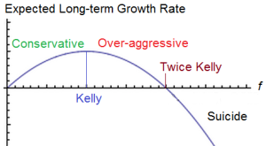

title: 凯利方程式
date: 2016-05-11 12:42:04
tags:
- 物理
- 金融
categories:
- 金融
---
[在概率论中，凯利公式（英语：Kelly formula），也称凯利方程式](https://zh.wikipedia.org/wiki/%E5%87%B1%E5%88%A9%E5%85%AC%E5%BC%8F)。

凯利公式的最一般性陈述为，借由寻找能最大化结果对数期望值的资本比例f*，即可获得长期增长率的最大化。对于只有两种结果（输去所有注金，或者获得资金乘以特定赔率的彩金）的简单赌局而言，可由一般性陈述导出以下式子：

$f^* = \frac{bp-q}{b}$  , 其中

>f\*为现有资金应进行下次投注的比例；
b为投注可得的赔率（不含本金）；
p为获胜率；
 为落败率，即1 - p；

方程式假设货币与赌局可无穷分割，而只要资金足够多，在实际应用上不成问题。举例而言，若一赌博有60%的获胜率（p = 0.6，q = 0.4），而赌客在赢得赌局时，可获得二对一的赔率（b = 1），则赌客应在每次机会中下注现有资金的20%（f* = 0.2），以最大化资金的长期增长率。

As we can see from the diagram above, if we bet twice Kelly, we would have an expected growth rate of zero, and further increasing our bet would be a suicide in long run, even if we have the advantage in the gamble. The expected long-term growth rate will also decrease when the gambler bets aggressively, yet with higher risk than Kelly. This is why some gamblers would use a “Half Kelly”, half betting size of Kelly’s Criterion, to protect them from being over-aggressive. The size is halved while the expected growth rate is 75% of Kelly’s, which makes “Half Kelly” a welcoming choice.

[1] [kellys criterion](https://pjdelta.wordpress.com/2014/03/24/kellys-criterion/)