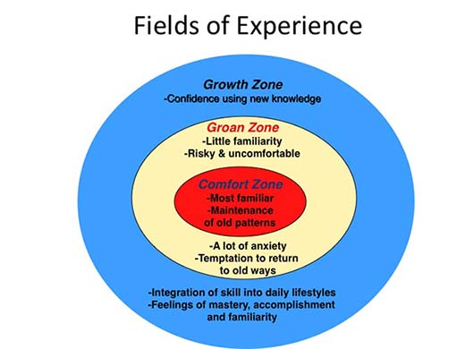

title: '扩大舒适区，成为真正的高手'
date: 2016-08-25 15:47:53
tags:
- 读书笔记
categories:
- 随笔
---

最近一直在关注经济社会变化趋势，各种新闻热点的连番轰炸，弄的我有点心力交瘁。今天在罗胖子的《罗辑思维》听了第一集《怎样成为一个高手》，里面提出了一个点让我有所感触，就是美国人Noel Tichy提出的“Fields of Experience”理论。

心理学研究说，人类对于外部世界的认识可分为三个区域：舒适区（comfort zone），学习区（stretch zone），和恐慌区（stress zone）。
1. 舒适区：在舒适区我们得心应手，每天处于熟悉的环境中，做在行的的事情，和熟悉的人交际，甚至你就是这个领域的专家，对这个区域中的人和事感觉很舒适。但是学到的东西很少，进步缓慢，而且一旦跳出这个领域，面对不熟悉的环境及变化，你可能会觉得有压力，无所适从。
2. 学习区：我们很少接触甚至未曾涉足的领域，充满新颖的事物，在这里可以充分的锻炼自我，挑战自我。比如，生活中，换一条上班的路线；学习中，接触另一个专业的书籍；工作中，切换到另外一个岗位。
3. 恐慌区，顾名思义，在这个区域中会感到忧虑，恐惧，不堪重负。比如在公共场合演讲，或者从事一些危险的极限运动。
只有在“学习区”内做事，人才会进步。尝试新鲜事物，探索未知领域，能开拓思维和视野，激发潜力。如果现在的你在恐慌区，那么首要就是要建立自信，克服恐惧和忧虑，马克吐温：【我曾经有很长一段时间生活在恐惧之中，但是事实上大部分我所忧虑的事情并没有发生】。很多事情其实很简单，只是我们在思想上把他们复杂化、困难化了。
  
这是一个看起来“大家都知道”的道理。不过，这个理论反过来可以帮助我们根据自己心里状态调整心态，从而找到一个理想的学习状态。因为最近这段时间，我也正是陷入恐慌区中，时常陷入焦虑，慌乱，无所适从。按这个原理，我应该给自己重新定位，放松一点，找回最好的学习状态，让自己更快速的成长。
往往会有一个误区，就是介于学习区和舒适区之间的“舒适的学习”。真正的学习，需要付出努力并且认真的思考后，固化到大脑的物理结构中才能发挥效用。走马观花，最终可能并不会带来知识上的收获。