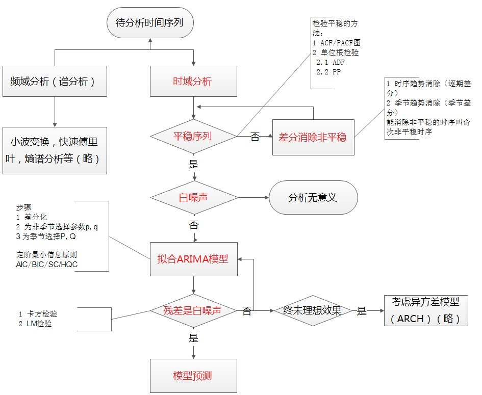

title: 时间序列分析方法
date: 2016-05-09 13:55:56
tags:
- 机器学习
- 算法
- 时间序列分析
categories:
- 机器学习
-----------
时间序列分析是根据系统观测得到的时间序列数据，通过曲线拟合和参数估计来建立数学模型的理论和方法。它一般采用曲线拟合和参数估计方法（如非线性最小二乘法）进行。时间序列分析常用在国民经济宏观控制、区域综合发展规划、企业经营管理、市场潜量预测、气象预报、水文预报、地震前兆预报、农作物病虫灾害预报、环境污染控制、生态平衡、天文学和海洋学等方面。

### [自回归滑动平均模型 (Autoregressive moving average model, ARMA)](https://zh.wikipedia.org/wiki/ARMA%E6%A8%A1%E5%9E%8B)
是研究时间序列的重要方法，由自回归模型（简称AR模型）与滑动平均模型（简称MA模型）为基础“混合”构成。在市场研究中常用于长期追踪资料的研究，如：Panel研究中，用于消费行为模式变迁研究；在零售研究中，用于具有季节变动特征的销售量、市场规模的预测等。

### [差分整合移动平均自回归模型 (Autoregressive Integrated Moving Average model, ARIMA)](https://zh.wikipedia.org/wiki/ARIMA%E6%A8%A1%E5%9E%8B)
差分整合移动平均自回归模型，又称整合移动平均自回归模型（移动也可称作滑动），时间序列预测分析方法之一。ARIMA（p，d，q）中，AR是"自回归"，p为自回归项数；MA为"滑动平均"，q为滑动平均项数，d为使之成为平稳序列所做的差分次数（阶数）。“差分”一词虽未出现在ARIMA的英文名称中，却是关键步骤。

<!--### [神经网络预测]-->
<!--### [SVM预测]-->
<!--### [灰色预测]-->
<!--### [模糊预测]-->
<!--### [组合预测]-->

### [协整理论 (cointegration)](http://wiki.mbalib.com/wiki/%E5%8D%8F%E6%95%B4%E7%90%86%E8%AE%BA)
协整即存在共同的随机性趋势。协整检验的目的是决定一组非平稳序列的线性组合是否具有稳定的均衡关系，伪回归的一种特殊情况即是两个时间序列的趋势成分相同，此时可能利用这种共同趋势修正回归使之可靠。正是由于协整传递出了一种长期均衡关系，若是能在看来具有单独随机性趋势的几个变量之间找到一种可靠联系，那么通过引入这种醉汉与狗之间距离的“相对平稳”对模型进行调整，可以排除单位根带来的随机性趋势，即所称的误差修正模型。

[1] [(Stanford)Deep learning for time series model](http://cs229.stanford.edu/proj2012/BussetiOsbandWong-DeepLearningForTimeSeriesModeling.pdf)
[2] [JoinQuant中的协整案例](https://www.joinquant.com/algorithm/index/edit?algorithmId=8d6377bc4f2b85a702e28251f49bbbef)
